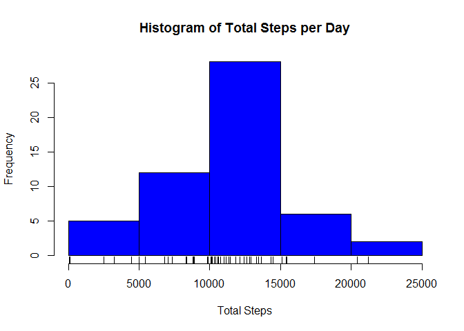
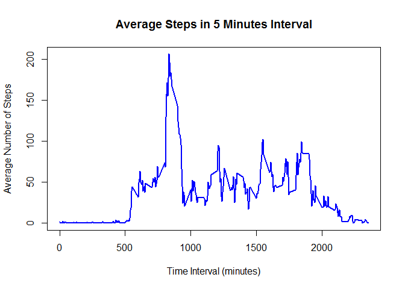
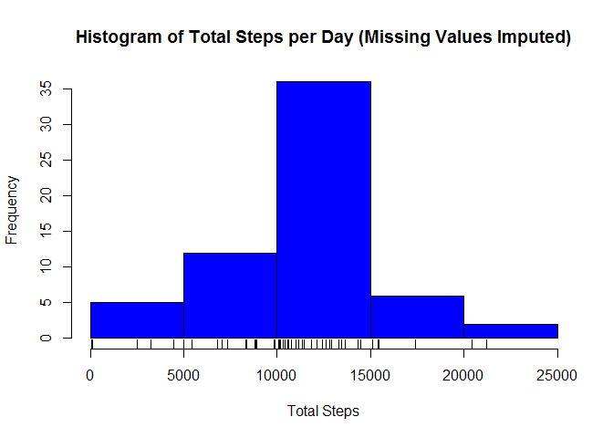
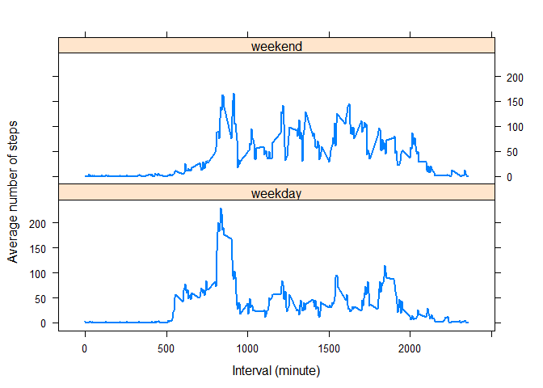

# Reproducible Research: Peer Assessment 1

---

## Loading and preprocessing the data

Download and extract data file if not available

```r
if (!file.exists("activity.csv")) {       
	if (!file.exists("repdata-data-activity.zip")) {
                download.file("https://d396qusza40orc.cloudfront.net/repdata%2Fdata%2Factivity.zip",
                               "repdata-data-activity.zip", method="auto",mode="wb")
	}
unzip("repdata-data-activity.zip")
}
```

Loading data

```r
activity<-read.csv("activity.csv",header=TRUE)
```

Overview of the dataset:


```r
summary(activity)
```

```
##      steps                date          interval     
##  Min.   :  0.00   2012-10-01:  288   Min.   :   0.0  
##  1st Qu.:  0.00   2012-10-02:  288   1st Qu.: 588.8  
##  Median :  0.00   2012-10-03:  288   Median :1177.5  
##  Mean   : 37.38   2012-10-04:  288   Mean   :1177.5  
##  3rd Qu.: 12.00   2012-10-05:  288   3rd Qu.:1766.2  
##  Max.   :806.00   2012-10-06:  288   Max.   :2355.0  
##  NA's   :2304     (Other)   :15840
```

```r
str(activity)
```

```
## 'data.frame':	17568 obs. of  3 variables:
##  $ steps   : int  NA NA NA NA NA NA NA NA NA NA ...
##  $ date    : Factor w/ 61 levels "2012-10-01","2012-10-02",..: 1 1 1 1 1 1 1 1 1 1 ...
##  $ interval: int  0 5 10 15 20 25 30 35 40 45 ...
```

**NOTE:** Missing values exists in the source dataset  
  
---

## What is mean total number of steps taken per day?

Calculating total steps taken per day and excluding missing value rows

```r
total_steps1<-aggregate(steps ~ date, data=activity, FUN=sum, na.rm=TRUE)
```

Histogram of total number steps per day


```r
hist(total_steps1$steps,
     xlab="Total Steps",
     main="Histogram of Total Steps per Day",
     col="blue")
rug(total_steps1$steps)
```

 

*Very often the total number of steps recorded per day ranges between 10000 - 15000 steps  
  
  
  
Calculating mean and median of total number of steps per day

```r
mean_tot1<-mean(total_steps1$steps)
mean_tot1
```

```
## [1] 10766.19
```

The mean of the total number of steps taken per day (excluding missing values) is 10766.19 which corresponds to the histogram's highest frequencies step range of between 10000 and 15000.


```r
median_tot1<-median(total_steps1$steps)
median_tot1
```

```
## [1] 10765
```

The median of the total number of steps taken per day (excluding missing values) is 10765. 

---

## What is the average daily activity pattern?

Calculating mean/average steps per day 

```r
mean_steps<-aggregate(steps ~ interval, data=activity, FUN=mean, na.rm=TRUE)
```

Time series graph on average steps taken per day

```r
with(mean_steps, plot(interval, 
                     steps, 
                     type="l",
                     main="Average Steps in 5 Minutes Interval",
                     xlab="Time Interval (minutes)",
                     ylab="Average Number of Steps",
                     col="blue",
                     lwd=2)
    )
```

 


```r
max_interval<-mean_steps[which.max(mean_steps$steps),]
max_interval
```

```
##     interval    steps
## 104      835 206.1698
```

The highest number of average steps is recorded at interval 835 minutes with average steps count of 206.1698.

---

## Imputing missing values

There are a number of days/intervals with missing values in the source dataset. The presence of missing days may introduce bias into some calculations or summaries of the data.

The total number of missing values in the dataset:

```r
miss_val<-sum(is.na(activity$steps))
miss_val
```

```
## [1] 2304
```

2304 rows containing missing values in the source dataset.


```r
percent<-mean(is.na(activity$steps))
percent
```

```
## [1] 0.1311475
```
This represent around 13% of the total data row sets which may not necessary influences too much on the overall result.

In order to test this hypothesis therefore we need to attempt to impute the missing values and determine differences to the previous mean and median estimates.

The strategy chosen herewith is to substitute all missing values with the mean steps value for each interval.

Sample:

Missing values in source dataset

```r
head(activity)
```

```
##   steps       date interval
## 1    NA 2012-10-01        0
## 2    NA 2012-10-01        5
## 3    NA 2012-10-01       10
## 4    NA 2012-10-01       15
## 5    NA 2012-10-01       20
## 6    NA 2012-10-01       25
```

To substitute the missing values with average steps count calculated for each interval


```r
head(mean_steps)
```

```
##   interval     steps
## 1        0 1.7169811
## 2        5 0.3396226
## 3       10 0.1320755
## 4       15 0.1509434
## 5       20 0.0754717
## 6       25 2.0943396
```

Generating a new imputed dataset


```r
activity.filled<-activity
NA_index<-is.na(activity.filled$steps)
meansteps_to_fill<-tapply(activity.filled$steps, activity.filled$interval, mean, na.rm=TRUE, simplify=TRUE)
activity.filled$steps[NA_index]<-meansteps_to_fill[as.character(activity.filled$interval[NA_index])]
```

Sample result of imputed dataset whereby missing value of the correspoding interval is replaced.

```r
head(activity.filled)
```

```
##       steps       date interval
## 1 1.7169811 2012-10-01        0
## 2 0.3396226 2012-10-01        5
## 3 0.1320755 2012-10-01       10
## 4 0.1509434 2012-10-01       15
## 5 0.0754717 2012-10-01       20
## 6 2.0943396 2012-10-01       25
```

Verify no missing values in new imputed data set

```r
sum(is.na(activity.filled$steps))
```

```
## [1] 0
```


Calculating total steps taken per day from new imputed dataset 

```r
total_steps2<-aggregate(steps ~ date, data=activity.filled, FUN=sum, na.rm=TRUE)
```

Histogram of total number steps per day from new imputed data set

```r
hist(total_steps2$steps,
     xlab="Total Steps",
     main="Histogram of Total Steps per Day (Missing Values Imputed)",
     col="blue")
rug(total_steps2$steps)
```

 

Since mean/average steps count for each interval was used to replace the missing values hence the highest total number of average steps recorded is still within the range of 10000 - 15000 steps per day. The frequency of occurences has increased due to missing values imputation which had added additional 2304 rows to the dataset. Below mean and median calculation will strengthen this observation. 


```r
mean_tot2<-mean(total_steps2$steps)
mean_tot2
```

```
## [1] 10766.19
```

New mean is 10766.19 which falls into the histogram's 10000-15000 steps range with highest frequencies.


```r
median_tot2<-median(total_steps2$steps)
median_tot2
```

```
## [1] 10766.19
```

New median is 10766.19 which also falls into the middle level of the histogram's complete total step ranges (in the middle of the X-axis).

Compared to the mean and median of the original dataset with missing values


```r
mean_tot1<-mean(total_steps1$steps)
mean_tot1
```

```
## [1] 10766.19
```


```r
median_tot1<-median(total_steps1$steps)
median_tot1
```

```
## [1] 10765
```

The new mean and median values have not differ much from the original mean and median estimates. 

This is mainly due to the missing 2304 rows  were replaced with means step count value. These values fills in mostly into the middle range of the dataset. (Use the histogram to visualize this, the increases in the number of frequencies for step ranges 10000-15000). Hence mean value remains the same. 

As for the median value since the missing values were replaced with mean steps count values. When the entire step count ranges is sorted from lowest to highest, the replaced values will most likely be inserted  in the middle level. Hence the median value will not have differ too much as well when compared to the previous median estimate. 

The imputation of the missing data has therefore has not caused any significant changes to the estimates on total daily steps.

---

## Are there differences in activity patterns between weekdays and weekends?

Creating a new factor variable to determine day of week for the new imputed dataset

```r
activity.filled$daytype<-factor(weekdays(as.POSIXlt(activity.filled$date)))
head(activity.filled)
```

```
##       steps       date interval daytype
## 1 1.7169811 2012-10-01        0  Monday
## 2 0.3396226 2012-10-01        5  Monday
## 3 0.1320755 2012-10-01       10  Monday
## 4 0.1509434 2012-10-01       15  Monday
## 5 0.0754717 2012-10-01       20  Monday
## 6 2.0943396 2012-10-01       25  Monday
```
Categorize day of week to either "weekday"" or "weekend"

```r
levels(activity.filled$daytype)<-list( 
        weekday =c("Monday","Tuesday","Wednesday","Thursday","Friday"), 
        weekend= c("Saturday","Sunday")
        )
head(activity.filled)
```

```
##       steps       date interval daytype
## 1 1.7169811 2012-10-01        0 weekday
## 2 0.3396226 2012-10-01        5 weekday
## 3 0.1320755 2012-10-01       10 weekday
## 4 0.1509434 2012-10-01       15 weekday
## 5 0.0754717 2012-10-01       20 weekday
## 6 2.0943396 2012-10-01       25 weekday
```
Calculating mean/average steps count per day with the dataset

```r
mean_steps2<-aggregate(steps ~ interval+daytype, data=activity.filled, FUN=mean, na.rm=TRUE)
```

Time series graph on average steps taken by day of week

```r
library(lattice)
xyplot(mean_steps2$steps ~ mean_steps2$interval | mean_steps2$daytype, 
       layout = c(1, 2), 
       type = "l", 
       xlab = "Interval (minute)", 
       ylab = "Average number of steps",
       lwd=2)
```

 


From the graph itself, the overall weekend and weekday activity pattern are not exactly the same. 

One can probably draw some assumptions based on the graph:  

* Between interval 0 till 500 minutes, the average steps recorded for both weekend and weekday are relatively low. This could be due to when the test subject was sleeping. 

* From minute interval 500  minutes onwards, the activity pattern differs:  

    * For weekday, there is a max spike at minute interval 835. This could be when the test subject is walking/going to work. Then it follows by some overall lower activity trend. This could be when the test subject is stationary/ sitting down and working. Hence steps count recorded during this period is lower.
  
    * For weekend, after the low activity period between 0 till 500 minutes interval. The overall activity trend throughout the recording period is relatively higher (with the exception of the weekday's peak during the beginning period) when compared to the weekday pattern. This could be due to the test subject is constantly moving about during the weekend.
  
  
  
  
  
        
    
        

